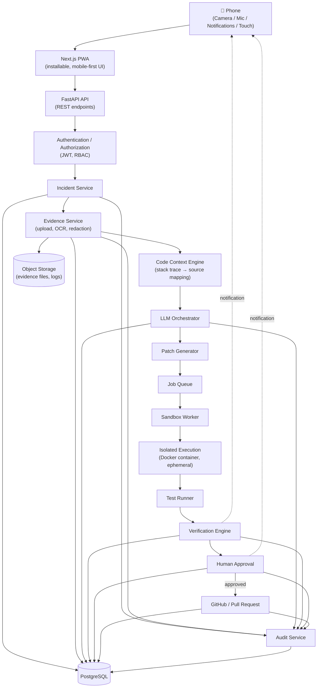
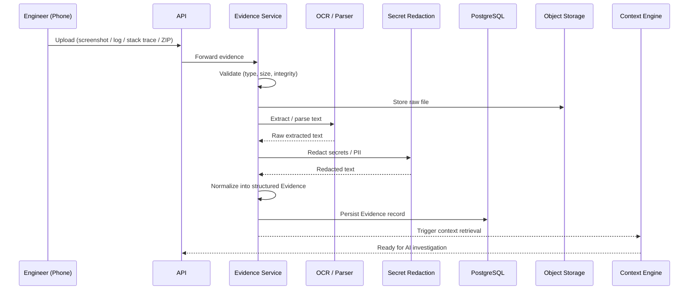
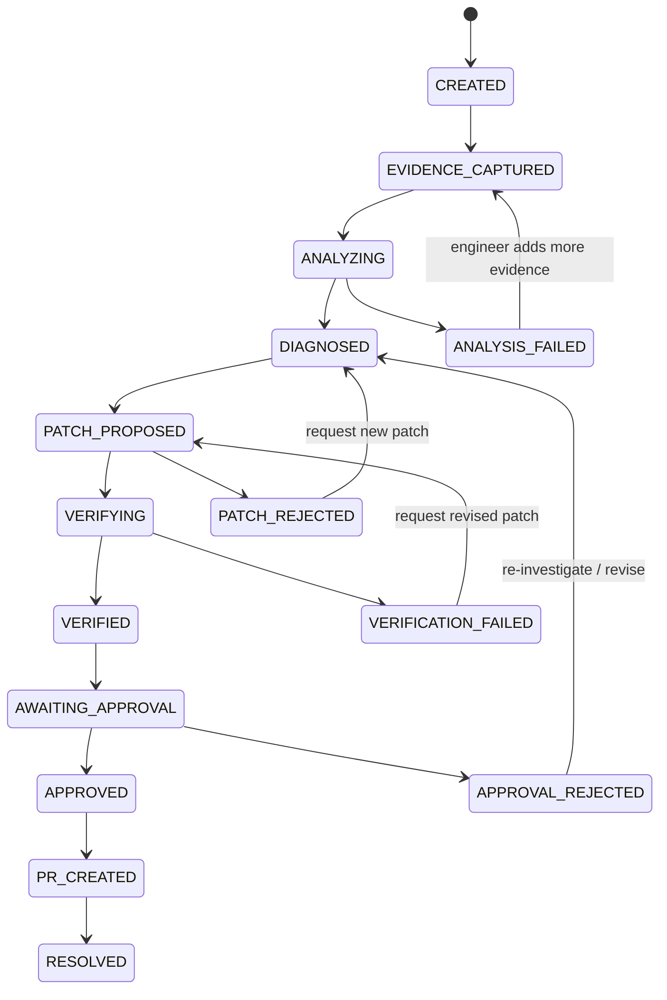
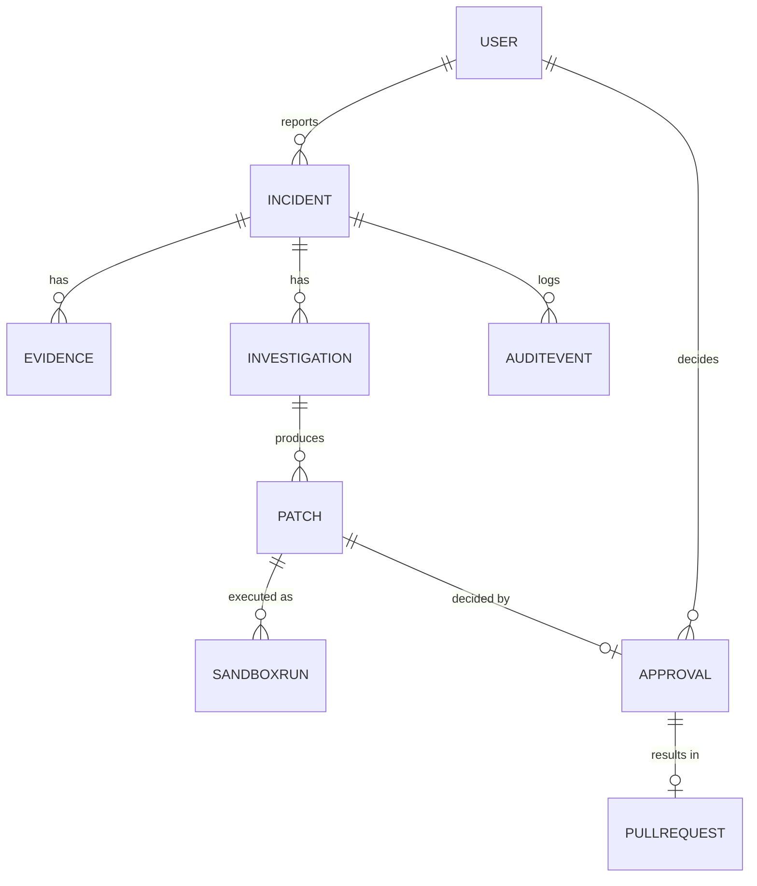
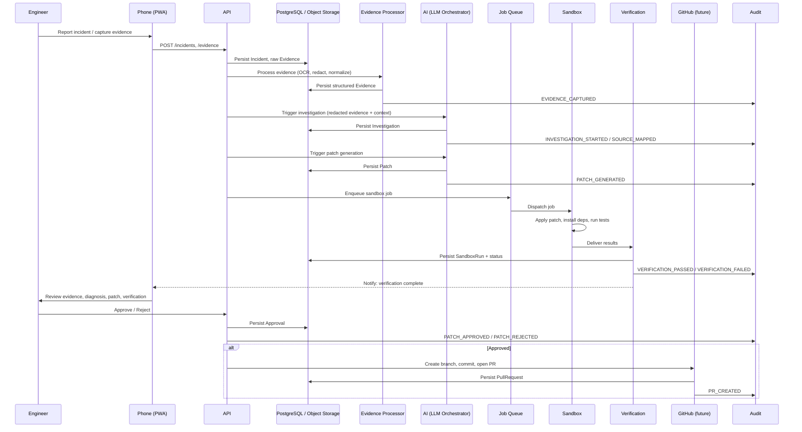

# OOPS.X-Ray

## FIX PRODUCTION FROM YOUR PHONE.

OOPS.X-Ray is a phone-first, AI-assisted incident-response and production-remediation platform. It helps engineers move from a production incident to an **evidence-backed diagnosis**, a **proposed code fix**, **isolated verification**, **human approval**, and a **controlled pull request** — without needing a laptop to start the process.

> **AI PROPOSES. EVIDENCE SUPPORTS. HUMANS APPROVE.**

| Field | Value |
|---|---|
| Status | Mixed — see [Section 26: MVP Implementation](#26-mvp-implementation) for BUILT / MVP / FUTURE breakdown |
| Project Type | Phone-first incident response |
| Primary Interface | Phone (installable Progressive Web App) |
| Core Workflow | Incident → Evidence → Diagnosis → Patch → Verification → Approval → PR |

> **Note on status labeling:** Throughout this document, every capability is explicitly tagged **[BUILT]**, **[MVP]**, or **[FUTURE]**. Nothing described here should be assumed complete unless tagged **[BUILT]**.

---

## Table of Contents

1. [What Is OOPS.X-Ray?](#3-what-is-oopsx-ray)
2. [Problem](#4-problem)
3. [Core Concept — The Golden Path](#5-core-concept)
4. [Complete System Architecture](#6-complete-system-architecture)
5. [Detailed Component Architecture](#7-detailed-component-architecture)
6. [Phone-First Architecture](#8-phone-first-architecture)
7. [Local vs Backend Processing](#9-local-vs-backend-processing)
8. [Evidence Pipeline](#10-evidence-pipeline)
9. [File Upload Architecture](#11-file-upload-architecture)
10. [Git Architecture](#12-git-architecture)
11. [AI Architecture](#13-ai-architecture)
12. [Patch Generation](#14-patch-generation)
13. [Sandbox Architecture](#15-sandbox-architecture)
14. [Verification Engine](#16-verification-engine)
15. [Human Approval](#17-human-approval)
16. [Incident State Machine](#18-incident-state-machine)
17. [Database Architecture](#19-database-architecture)
18. [API Architecture](#20-api-architecture)
19. [Frontend Architecture](#21-frontend-architecture)
20. [Security Model](#22-security-model)
21. [Audit Trail](#23-audit-trail)
22. [Complete Data Flow](#24-complete-data-flow)
23. [Technology Stack](#25-technology-stack)
24. [MVP Implementation](#26-mvp-implementation)
25. [30-Hour Implementation Plan](#27-30-hour-implementation-plan)
26. [Failure Handling](#28-failure-handling)
27. [Scalability](#29-scalability)
28. [Demo](#30-demo)
29. [Why Phone-First](#31-why-phone-first)
30. [USP](#32-usp)
31. [Visual Documentation](#33-visual-documentation)
32. [Repository Structure](#34-repository-structure)
33. [Engineering Principles](#35-engineering-principles)
34. [Documentation Assets](#documentation-assets)

---

## 3. What Is OOPS.X-Ray?

OOPS.X-Ray is **not**:

- ❌ An AI chatbot that talks about your code.
- ❌ A general-purpose AI coding assistant (e.g., autocomplete or "write me a function").
- ❌ A monitoring dashboard.
- ❌ A mobile-shrunk copy of an existing desktop observability tool.

OOPS.X-Ray **is** an end-to-end incident-remediation pipeline where a phone is the primary console, and every AI-generated recommendation is:

1. **Grounded in captured evidence** (logs, stack traces, screenshots, source code) — not general knowledge.
2. **Verified in an isolated sandbox** before a human ever sees it as "safe."
3. **Subject to explicit human approval** before it can become a pull request.

The engineering problem OOPS.X-Ray solves is the chain of custody between a production failure and a trustworthy code change:

```
Production incident
      ↓
Evidence collection
      ↓
Context reconstruction
      ↓
Diagnosis
      ↓
Patch proposal
      ↓
Isolated verification
      ↓
Human decision
      ↓
Code change
```

Evidence and verification sit at the center of this design because an AI-generated patch is only as trustworthy as (a) the evidence it was grounded in, and (b) proof that it doesn't break existing behavior. OOPS.X-Ray treats "the AI suggested a fix" as the *least* interesting fact in the pipeline — what matters is what evidence supports the diagnosis, and what test/verification results support the patch.

---

## 4. Problem

### A representative scenario

A Payment API in production starts returning **HTTP 500** errors under load. On-call is paged.

### The traditional workflow

```
Alert
 → Laptop
 → Monitoring dashboard
 → Logs
 → Stack trace
 → Repository
 → Source code
 → Debug
 → Fix
 → Test
 → Review
 → Pull Request
```

This workflow has structural problems:

| Problem | Why it hurts |
|---|---|
| **Laptop dependency** | The responder may not have a laptop immediately available (commuting, at dinner, on-site elsewhere). Time-to-first-action is delayed by device access, not by diagnostic difficulty. |
| **Fragmented evidence** | Logs live in one tool, stack traces in another, metrics in a third. Reconstructing "what happened" is manual and slow. |
| **Context switching** | Moving between monitoring, terminal, IDE, and chat tools breaks the responder's train of thought. |
| **Difficult source mapping** | Mapping a stack trace or log line back to the exact source file/function is manual and error-prone, especially under stress. |
| **Difficulty reproducing failures** | Production-only failures (load, data, environment-specific) are hard to reproduce locally. |
| **Risk of blindly trusting AI-generated code** | An AI suggestion with no evidence trail and no test proof is not safe to merge, let alone deploy. |
| **Production security concerns** | Ad hoc scripts, direct production access, and untracked changes increase risk. |
| **Lack of auditability** | Without a structured record of what evidence led to what change, incident retrospectives are incomplete. |

### The core problem OOPS.X-Ray addresses

> **How can an engineer safely move from a production incident to a verified engineering change — from a phone, under time pressure, without sacrificing evidence, safety, or auditability?**

---

## 5. Core Concept

### The Golden Path

```
INCIDENT
   ↓
CAPTURE
   ↓
EVIDENCE
   ↓
ANALYZE
   ↓
PROPOSE
   ↓
SANDBOX
   ↓
VERIFY
   ↓
HUMAN APPROVAL
   ↓
PULL REQUEST
   ↓
AUDIT
```

| Stage | Data In | What Happens | Data Out |
|---|---|---|---|
| **INCIDENT** | Alert, or manual report by engineer | An `Incident` record is created with severity/title/description | `incident_id` |
| **CAPTURE** | Photo of a screen, log file, terminal output, ZIP of a project | Phone captures raw evidence (camera, file picker, mic) | Raw evidence blobs |
| **EVIDENCE** | Raw evidence blobs | Upload, validation, OCR/parsing, secret redaction, normalization | Structured `Evidence` records |
| **ANALYZE** | Structured evidence + relevant source context | Stack-trace parsing, code context retrieval, LLM-based root-cause analysis | `Investigation` (root cause, affected files, confidence) |
| **PROPOSE** | Investigation + retrieved source | LLM proposes a minimal diff | `Patch` (diff, target files) |
| **SANDBOX** | Patch + project source | Patch applied to an ephemeral, isolated container | Sandbox run environment |
| **VERIFY** | Sandbox run | Build, tests, health checks executed | `SandboxRun` result: VERIFIED / FAILED / TIMEOUT / ERROR |
| **HUMAN APPROVAL** | Incident, evidence, investigation, patch, verification result | Engineer reviews everything on their phone and approves or rejects | `Approval` record |
| **PULL REQUEST** | Approved patch | Branch created, patch committed, PR opened against the source repository | `PullRequest` record |
| **AUDIT** | Every event above | Immutable, timestamped record of the full chain | `AuditEvent` log |

No stage is allowed to skip ahead: a patch cannot reach human approval without a verification result, and no change reaches source control without explicit human approval.

---

## 6. Complete System Architecture

OOPS.X-Ray is implemented as a **modular monolith backend with dedicated background workers**, rather than a large microservices mesh. For a hackathon-scale MVP, a single FastAPI application with clearly separated internal service modules (Incident, Evidence, Context, Orchestrator, Patch) is more reliable to build, deploy, and demo than a distributed system — while a **separate, isolated worker process** is still used specifically for sandboxed code execution, because that workload has fundamentally different security and resource requirements from the rest of the API.



**Design rationale:**

- **Everything except sandbox execution** runs inside the FastAPI process and its internal service modules — this keeps the MVP simple to run and debug (`docker-compose up`).
- **Sandbox execution is deliberately isolated** into its own worker, communicating only via a job queue, because it is the only component that executes code it did not author (the AI-generated patch applied to the user's project). This is a hard security boundary, not an implementation convenience.
- **PostgreSQL** is the single source of truth for structured state (incidents, evidence metadata, investigations, patches, sandbox runs, approvals, PRs, audit events).
- **Object Storage** holds large/binary evidence (screenshots, logs, uploaded ZIPs) — PostgreSQL stores references (keys/paths), not the blobs themselves.

---

## 7. Detailed Component Architecture

### 7.1 Mobile / PWA

- **Purpose:** Primary interface for engineers to report incidents, capture evidence, and review/approve AI proposals.
- **Responsibilities:** Incident creation UI, camera/file capture, evidence review, patch review (diff viewer), approval actions, push notifications.
- **Inputs:** User touch input, camera frames, microphone audio, file picker selections, API responses.
- **Outputs:** HTTPS requests to the API, local notifications.
- **Dependencies:** FastAPI API, browser Service Worker (for PWA install/offline shell).
- **Security considerations:** Auth tokens stored securely on-device; HTTPS only; no secrets rendered in plaintext beyond what's necessary for review.
- **Failure modes:** Poor network connectivity during upload (needs retry/resume for MVP-scale files); camera/OCR failure on low-quality captures.

### 7.2 API Gateway / FastAPI

- **Purpose:** Single entry point for all client requests.
- **Responsibilities:** Routing, request validation, calling internal services, response shaping.
- **Inputs:** HTTPS requests from the PWA.
- **Outputs:** JSON responses; triggers to internal services and the job queue.
- **Dependencies:** Auth module, all internal services.
- **Security considerations:** Input validation on every endpoint; rate limiting on upload/investigation endpoints.
- **Failure modes:** Downstream service unavailability should return clear error codes, not silent failures.

### 7.3 Authentication

- **Purpose:** Verify the identity of the requesting engineer.
- **Responsibilities:** Login, token issuance, token verification on each request.
- **Inputs:** Credentials or session token.
- **Outputs:** Signed JWT (or equivalent) with user identity and role claims.
- **Dependencies:** PostgreSQL (`User` table).
- **Security considerations:** Hashed credential storage, short-lived tokens, HTTPS transport only.
- **Failure modes:** Expired/invalid tokens rejected with 401; no silent fallback to unauthenticated access.

### 7.4 Incident Service

- **Purpose:** Own the lifecycle of an `Incident`.
- **Responsibilities:** Create/read incidents, enforce the [state machine](#18-incident-state-machine), link evidence/investigation/patch/approval records to an incident.
- **Inputs:** Incident creation payloads, state-transition triggers from other services.
- **Outputs:** `Incident` records, state-change events for Audit.
- **Dependencies:** PostgreSQL, Audit Service.
- **Security considerations:** Only the reporting user or authorized roles can transition/modify an incident.
- **Failure modes:** Invalid state transitions are rejected explicitly (see Section 18).

### 7.5 Evidence Service

- **Purpose:** Manage capture, validation, and normalization of all evidence.
- **Responsibilities:** Accept uploads, run OCR on images, parse logs, invoke secret redaction, persist normalized evidence.
- **Inputs:** Raw files (images, logs, ZIP archives) from the PWA.
- **Outputs:** `Evidence` records with normalized, redacted content; object storage keys.
- **Dependencies:** Object Storage, Secret Redaction, Stack Trace Parser, PostgreSQL.
- **Security considerations:** Size limits, file-type validation, ZIP-bomb protection (see Section 11).
- **Failure modes:** Corrupt/unreadable files are marked failed, not silently dropped; OCR low-confidence results are flagged for manual review.

### 7.6 Object Storage

- **Purpose:** Durable storage for binary evidence and large artifacts.
- **Responsibilities:** Store/retrieve screenshots, logs, ZIP uploads, sandbox output logs.
- **Inputs:** Binary blobs from the Evidence Service and Sandbox Worker.
- **Outputs:** Signed/authenticated retrieval URLs or byte streams.
- **Dependencies:** None (leaf storage layer).
- **Security considerations:** Access-controlled buckets/paths; no public bucket listing.
- **Failure modes:** Upload failures must be retried explicitly, not assumed successful.

### 7.7 PostgreSQL

- **Purpose:** System of record for all structured entities.
- **Responsibilities:** Store `User`, `Incident`, `Evidence`, `Investigation`, `Patch`, `SandboxRun`, `Approval`, `PullRequest`, `AuditEvent`.
- **Inputs/Outputs:** Reads/writes from every backend service.
- **Dependencies:** None (leaf data layer).
- **Security considerations:** Least-privilege DB roles per service where feasible; no secrets stored in plaintext columns.
- **Failure modes:** Transactions used for multi-table writes (e.g., patch approval + PR record creation) to avoid partial state.

### 7.8 Secret Redaction

- **Purpose:** Prevent credentials/secrets/PII captured in evidence from reaching storage, logs, or the LLM in plaintext.
- **Responsibilities:** Pattern-based scanning and redaction of evidence text (API keys, tokens, passwords, connection strings).
- **Inputs:** Raw OCR/log text.
- **Outputs:** Redacted text with secrets replaced by placeholders (e.g., `[REDACTED_TOKEN]`).
- **Dependencies:** Evidence Service.
- **Security considerations:** Redaction happens **before** persistence and **before** the LLM ever sees the content.
- **Failure modes:** Over-redaction is preferred to under-redaction; ambiguous matches are redacted by default.

### 7.9 Stack Trace Parser

- **Purpose:** Convert raw stack trace text into structured, source-referenceable data.
- **Responsibilities:** Extract file names, line numbers, function names, and exception types from log/stack trace text.
- **Inputs:** Redacted evidence text.
- **Outputs:** Structured trace frames (`file`, `line`, `function`, `exception`).
- **Dependencies:** Evidence Service, Code Context Engine.
- **Failure modes:** Unparseable traces fall back to raw-text search in the Context Engine.

### 7.10 Code Context Engine

- **Purpose:** Map evidence (parsed stack traces, error messages) to relevant source files within the uploaded/indexed project.
- **Responsibilities:** File indexing, symbol/text search, ranking of relevant files/functions.
- **Inputs:** Structured trace frames, uploaded project (ZIP-extracted or, in the future, cloned repository).
- **Outputs:** A ranked, bounded set of relevant source snippets.
- **Dependencies:** File index (from ZIP extraction or repo clone), Object Storage.
- **Security considerations:** Bounds the amount and selection of source code sent downstream — the entire repository is never sent to the LLM (see Section 13).
- **Failure modes:** No matching files found → investigation proceeds with lower confidence and flags this explicitly.

### 7.11 LLM Orchestrator

- **Purpose:** Coordinate calls to the LLM for root-cause analysis and patch generation, using only grounded, retrieved context.
- **Responsibilities:** Build structured prompts, call the model, parse and validate structured output.
- **Inputs:** Evidence + relevant source snippets from the Context Engine.
- **Outputs:** `Investigation` (root cause, affected files, confidence, explanation).
- **Dependencies:** Code Context Engine, external LLM API.
- **Security considerations:** Redacted evidence only; no full-repository dumps.
- **Failure modes:** Malformed/low-confidence model output is surfaced as such, not silently accepted.

### 7.12 Patch Generator

- **Purpose:** Produce a minimal, reviewable code diff addressing the diagnosed root cause.
- **Responsibilities:** Generate unified-diff-style patches scoped to the affected files identified by the investigation.
- **Inputs:** `Investigation` + relevant source snippets.
- **Outputs:** `Patch` record (diff text, target files).
- **Dependencies:** LLM Orchestrator.
- **Security considerations:** Patch is a **proposal only** — it is never applied outside the sandbox without human approval.
- **Failure modes:** If no safe minimal patch can be generated, the system reports "no patch proposed" rather than forcing a low-confidence guess.

### 7.13 Job Queue

- **Purpose:** Decouple patch generation from sandbox execution.
- **Responsibilities:** Queue sandbox jobs; track job status.
- **Inputs:** Patch-ready events from the Patch Generator.
- **Outputs:** Job dispatch to the Sandbox Worker.
- **Dependencies:** Sandbox Worker.
- **Failure modes:** Jobs that fail to dispatch are retried with backoff; stuck jobs surface a `TIMEOUT` status (Section 16).

### 7.14 Sandbox Worker

- **Purpose:** Execute untrusted, AI-generated patches safely, away from the main API process.
- **Responsibilities:** Provision an ephemeral container, apply the patch, install dependencies, run tests, collect results, tear down the environment.
- **Inputs:** `Patch` + project source.
- **Outputs:** `SandboxRun` record (status, logs, test results).
- **Dependencies:** Docker (isolated execution), Job Queue, Object Storage (for logs).
- **Security considerations:** No production credentials, no network access to production systems, resource-limited (see Section 15).
- **Failure modes:** Container failures, timeouts, and OOM kills are captured as explicit `SandboxRun` statuses.

### 7.15 Test Runner

- **Purpose:** Execute the project's build/test suite inside the sandbox container.
- **Responsibilities:** Run build steps and available tests; capture pass/fail output.
- **Inputs:** Patched project inside the container.
- **Outputs:** Structured test results (pass/fail counts, logs).
- **Dependencies:** Sandbox Worker / Docker.
- **Failure modes:** Missing/no test suite is reported explicitly rather than treated as a pass.

### 7.16 Verification Engine

- **Purpose:** Convert raw sandbox/test output into a definitive verification decision.
- **Responsibilities:** Evaluate build success, test results, and health checks against pass/fail criteria.
- **Inputs:** `SandboxRun` output.
- **Outputs:** Verification status: `VERIFIED`, `FAILED`, `TIMEOUT`, or `ERROR`.
- **Dependencies:** Test Runner, Sandbox Worker.
- **Security considerations:** A verification failure **must** block automatic progression to approval-ready state.
- **Failure modes:** Ambiguous results default to `FAILED`, never to `VERIFIED`.

### 7.17 Approval Service

- **Purpose:** Enforce human-in-the-loop review before any code change reaches source control.
- **Responsibilities:** Present incident, evidence, investigation, patch, and verification results to the engineer; record approve/reject decisions.
- **Inputs:** Full incident context bundle.
- **Outputs:** `Approval` record (approved/rejected, by whom, when, notes).
- **Dependencies:** Incident Service, Verification Engine, Git Integration.
- **Security considerations:** Only authorized roles (e.g., the incident owner or team lead) may approve.
- **Failure modes:** No default/auto-approval path exists.

### 7.18 Git Integration

- **Purpose:** Turn an approved patch into a real, reviewable pull request. **[FUTURE — see Section 12]**
- **Responsibilities:** Authenticate to the source host, create a branch, commit the patch, open a PR.
- **Inputs:** Approved `Patch`.
- **Outputs:** `PullRequest` record (URL, branch, commit SHA).
- **Dependencies:** Approval Service, external Git provider API.
- **Security considerations:** Read-only access by default; write access (branch/commit/PR) scoped narrowly and only invoked after explicit human approval.
- **Failure modes:** PR-creation failures are surfaced to the engineer with the exact error, not retried silently in the background.

### 7.19 Audit Service

- **Purpose:** Provide an immutable, chronological record of everything that happened for a given incident.
- **Responsibilities:** Append `AuditEvent` records for every significant state change (see Section 23).
- **Inputs:** Events from every other service.
- **Outputs:** Queryable audit log per incident.
- **Dependencies:** PostgreSQL.
- **Security considerations:** Append-only; no update/delete path for audit records.
- **Failure modes:** Audit write failures are treated as critical and logged/alerted separately, since a missing audit trail undermines the trust model.

---

## 8. Phone-First Architecture

The phone is not just a remote control for a backend — it is an active system component that performs real work before evidence ever reaches the server.

```
📱 PHONE
├── Camera            → capture stack traces, terminal output, error dialogs, monitoring screens
├── OCR                → convert visual information into machine-readable evidence
├── Microphone          → capture spoken incident context ("payment API started failing around 2pm")
├── Notifications       → receive incident alerts, investigation results, verification results, approval requests
├── Touch UI            → review evidence, inspect patches (diffs), approve/reject
├── Local preprocessing → image preprocessing, OCR preprocessing, lightweight filtering
└── PWA                 → installable, mobile-first interface
```

**Camera.** The engineer photographs whatever is in front of them during an incident — a terminal window, a monitoring dashboard on a shared screen, an error dialog — instead of needing to reproduce or manually retype that information.

**OCR.** Captured images are converted into machine-readable text so that stack traces and log lines can be parsed and matched to source code, rather than remaining an opaque screenshot.

**Microphone.** Voice input lets the engineer describe context ("this started after the 2pm deploy") hands-free, which is then attached as evidence alongside visual captures.

**Notifications.** The phone is the channel through which the engineer is informed that an incident needs attention, that an investigation has completed, that verification has finished, or that a patch is awaiting their approval.

**Touch.** All review actions — reading evidence, inspecting the proposed diff, approving or rejecting — happen through a touch-first interface designed for one-handed use under time pressure.

**Local processing.** Where feasible, image and OCR preprocessing (e.g., cropping, contrast normalization) and lightweight filtering happen on-device before upload, to improve OCR accuracy and reduce upload size.

**PWA.** The interface is delivered as an installable Progressive Web App rather than a native app, for cross-platform reach without an app-store dependency.

No specific device hardware specifications or performance benchmarks are claimed; the architecture is designed to work on a modern smartphone browser capable of running a PWA with camera/microphone access.

---

## 9. Local vs Backend Processing

| Processing | Location | Purpose |
|---|---|---|
| Image preprocessing (crop, contrast) | **Local (phone)** | Improve OCR accuracy before upload |
| OCR preprocessing | **Local (phone)** | Reduce noise in captured text |
| Lightweight filtering | **Local (phone)** | Discard obviously empty/blank captures before upload |
| UI rendering & interaction | **Local (phone)** | Responsive, one-handed review/approval experience |
| Incident orchestration | **Backend** | Create/track incidents, enforce state machine |
| Repository/project retrieval | **Backend** | Extract and index uploaded project ZIP (MVP) / clone repository (future) |
| Context construction | **Backend** | Map evidence to relevant source files |
| LLM inference | **Backend** | Root-cause analysis and patch generation |
| Patch generation | **Backend** | Produce the diff |
| Persistent storage | **Backend** | PostgreSQL + Object Storage |
| Code execution / tests / health checks / verification | **Sandbox (isolated backend worker)** | Prove the patch is safe before a human reviews it |

The full AI model does **not** run on-device. All LLM inference happens on the backend, using evidence that has already been redacted. On-device processing is limited to image/OCR preprocessing and UI logic.

---

## 10. Evidence Pipeline



**Upload.** The phone sends a raw evidence file (screenshot, log file, stack trace text, or project ZIP) to the API.

**Validation.** File type, size, and basic integrity are checked before any further processing.

**Extraction.** For ZIP uploads, contents are securely extracted (see Section 11).

**OCR / Parsing.** Images are OCR'd; text files/logs are parsed directly.

**Secret Redaction.** All extracted text is scanned and redacted **before** persistence.

**Evidence Normalization.** Redacted content is converted into a structured `Evidence` record (type, source, extracted text, metadata).

**Storage.** Structured evidence is persisted in PostgreSQL; the raw file remains in Object Storage.

**Context Retrieval.** The Context Engine is triggered to map this evidence to relevant source files.

**AI Investigation.** Once context is retrieved, the LLM Orchestrator is invoked.

---

## 11. File Upload Architecture

### MVP upload model

For the hackathon MVP, the primary way a project's source code enters the system is a **ZIP upload**, not a live Git connection. This is deliberate: it removes the need for OAuth/Git-hosting integration to demonstrate the full Golden Path.

```
project.zip
error.log
screenshot.png
```

```
UPLOAD
   ↓
VALIDATE
   ↓
SECURE EXTRACTION
   ↓
PATH VALIDATION
   ↓
FILE INDEXING
   ↓
CODE SEARCH
   ↓
CONTEXT BUILDING
```

### Security protections

| Protection | Purpose |
|---|---|
| **Size limits** | Reject uploads above a configured maximum to bound resource usage |
| **Path traversal protection** | Reject/normalize any archive entry path containing `../` or absolute paths before extraction |
| **ZIP-bomb protection** | Enforce a maximum decompressed size / file count before and during extraction |
| **Malicious file handling** | Reject unexpected executable file types where not relevant to source analysis |
| **Secret scanning** | Run the same Secret Redaction pass on extracted source files as on evidence text |
| **Isolated processing** | Extraction and indexing happen in a constrained working directory, not the API process's arbitrary filesystem |

**Why ZIP upload is suitable for the MVP:** it requires no third-party OAuth flow, works for any project regardless of where it's hosted, and is sufficient to demonstrate the complete Golden Path (capture → evidence → diagnosis → patch → sandbox → verification → approval) within a hackathon timeframe. Live Git integration is defined as a **[FUTURE]** capability (Section 12).

---

## 12. Git Architecture — [FUTURE]

> This section describes a **future** capability. It is **not** part of the hackathon MVP, which uses ZIP upload (Section 11) instead.

### Preferred access model

A **read-only GitHub App installation or read-only deploy key** for repository access during investigation, with **write access requested and used only for the specific, human-approved operation** of opening a pull request.

```
Repository
   → Authentication
   → Clone
   → Index
   → File / Symbol Search
   → Stack Trace Mapping
   → Relevant Code
   → AI
```

**After human approval only:**

```
Patch
   → Branch
   → Commit
   → Pull Request
```

### Least privilege

- Investigation and context retrieval require only **read** access to repository contents.
- **Write** access (creating a branch, committing, opening a PR) is requested and exercised **only** after an `Approval` record exists for the specific patch.
- No direct commits to protected branches; all changes flow through a pull request for standard code review, even though the diff originated from the AI pipeline.

---

## 13. AI Architecture

```
INCIDENT
   → EVIDENCE
   → REDACTION
   → STACK TRACE PARSER
   → CODE CONTEXT RETRIEVAL
   → RELEVANT SOURCE
   → STRUCTURED PROMPT
   → LLM
   → STRUCTURED RESULT
```

### Why the entire repository is never sent to the model

Sending an entire codebase to an LLM is unnecessary, expensive, and increases the risk of the model reasoning about irrelevant code instead of the actual failure. Instead, OOPS.X-Ray performs **targeted context retrieval**:

1. **Context retrieval** — the Stack Trace Parser and Code Context Engine identify which files are actually implicated by the evidence.
2. **Relevant file selection** — only a bounded, ranked set of files/snippets is selected for the prompt.
3. **Evidence grounding** — the prompt includes the redacted evidence (logs, error text) alongside the selected source, so the model reasons from what actually happened, not from general assumptions.
4. **Root-cause analysis** — the model is asked to identify the most likely cause given the evidence and source provided.
5. **Affected-file detection** — the model identifies which files would need to change.
6. **Patch generation** — a minimal diff is produced, scoped to the affected files.
7. **Verification planning** — the model proposes what should be checked (e.g., "run the existing test suite for module X") to confirm the fix.
8. **Confidence** — the model reports a confidence score reflecting how well-supported its diagnosis is by the retrieved evidence/source.

### Structured output contract

The LLM Orchestrator requires the model to return a structured result, not free-form prose:

```json
{
  "root_cause": "string — plain-language description of the diagnosed cause",
  "affected_files": ["path/to/file1.ts", "path/to/file2.ts"],
  "confidence": 0.0,
  "explanation": "string — evidence-grounded explanation of the diagnosis",
  "patch": {
    "diff": "unified diff text",
    "target_files": ["path/to/file1.ts"]
  },
  "verification_plan": [
    "run unit tests for the auth module",
    "run integration test for /api/payments"
  ]
}
```

Only **observable evidence, outputs, and system behavior** are recorded and shown to the engineer — the system does not expose or persist hidden model reasoning/chain-of-thought. What the engineer sees is the evidence that was used, the structured `root_cause`/`explanation`, the resulting patch, and the verification outcome.

---

## 14. Patch Generation

A patch is represented as a standard unified diff, scoped to the specific files identified as affected:

```diff
--- a/auth/verify.ts
+++ b/auth/verify.ts
@@ -12,7 +12,7 @@
-  if (token) {
+  if (token && !isExpired(token)) {
     return true;
   }
   return false;
```

**Principles:**

- **Minimal changes** — the patch should be the smallest diff that plausibly addresses the diagnosed root cause, not a broad rewrite.
- **Affected files only** — the diff is scoped to the `affected_files` identified in the investigation.
- **Diff generation** — produced directly by the Patch Generator from the LLM's structured output.
- **Patch validation** — the diff is checked for applicability against the current source (i.e., it must apply cleanly) before being sent to the sandbox.
- **Human review before approval** — the raw diff is shown to the engineer in the approval UI; nothing about the patch is hidden.

The AI **proposes** a patch. It never applies that patch to production, and never merges or deploys it. That decision belongs entirely to the human approver, and even then, only after sandbox verification (Section 16) has passed.

---

## 15. Sandbox Architecture

This is the security-critical core of the system: **untrusted, AI-generated code must never execute on the main API server.**

```
PATCH
   ↓
JOB QUEUE
   ↓
SANDBOX WORKER
   ↓
EPHEMERAL CONTAINER
   ↓
APPLY PATCH
   ↓
INSTALL DEPENDENCIES
   ↓
RUN TESTS
   ↓
HEALTH CHECK
   ↓
COLLECT LOGS
   ↓
RETURN RESULT
   ↓
DESTROY ENVIRONMENT
```

### Isolation guarantees

| Control | Description |
|---|---|
| **CPU limits** | Container is capped to a fixed CPU allocation to prevent resource exhaustion |
| **Memory limits** | Container is capped to a fixed memory allocation; exceeding it results in an `ERROR` verdict, not a crash of the host |
| **Execution timeout** | Every sandbox run has a hard wall-clock timeout; exceeding it results in a `TIMEOUT` verdict |
| **Filesystem isolation** | The container only has access to a copy of the uploaded project — never the host filesystem or other incidents' data |
| **Restricted permissions** | The process inside the container runs without elevated/root privileges where possible |
| **Restricted network** | No outbound network access to production systems; network access is limited to what's required to install dependencies (e.g., package registries), and can be fully disabled for fully offline-capable projects |
| **No production credentials** | The sandbox never receives production secrets, API keys, or database credentials |
| **Ephemeral containers** | A new container is provisioned per sandbox run and destroyed afterward — no state persists between runs |

> **Hard rule:** The AI-generated patch is applied and executed **only** inside this isolated, ephemeral container — never inside the FastAPI process, never on a host with access to production systems or credentials.

---

## 16. Verification Engine

The Verification Engine converts raw sandbox output into a definitive, machine-checkable verdict.

**Checks performed (where available for the project):**

- Build success
- Unit tests
- Integration tests (where available in the uploaded project)
- Regression tests (existing test suite, unmodified)
- Health checks (e.g., process starts and responds, where applicable)

**Possible outcomes:**

| Outcome | Meaning |
|---|---|
| `VERIFIED` | Build succeeded and all executed checks passed |
| `FAILED` | Build succeeded but one or more checks failed |
| `TIMEOUT` | Execution did not complete within the allotted time |
| `ERROR` | Sandbox execution itself failed (e.g., resource limit hit, unexpected crash) |

A `FAILED`, `TIMEOUT`, or `ERROR` outcome **must** prevent the patch from being presented as verified. It can still be shown to the human approver — but clearly labeled as unverified/failed, so the engineer is never misled into approving an unverified change.

---

## 17. Human Approval

```
AI PROPOSES
   ↓
EVIDENCE
   ↓
VERIFICATION
   ↓
ENGINEER REVIEWS
   ↓
APPROVE / REJECT
```

Before approving or rejecting, the engineer sees, on their phone:

- The original incident (title, description, severity)
- All captured evidence (screenshots, logs, OCR'd text)
- The diagnosed root cause and explanation
- The affected files
- The proposed patch (full diff)
- The verification result (`VERIFIED` / `FAILED` / `TIMEOUT` / `ERROR`) and relevant logs/test output

**There is no autonomous production deployment path.** Every patch that reaches source control does so because a human explicitly approved it, after seeing both the evidence and the verification outcome.

---

## 18. Incident State Machine



| State | Meaning |
|---|---|
| `CREATED` | Incident record created |
| `EVIDENCE_CAPTURED` | At least one piece of evidence has been uploaded and processed |
| `ANALYZING` | AI investigation in progress |
| `DIAGNOSED` | Investigation completed with a root cause |
| `PATCH_PROPOSED` | A patch has been generated |
| `VERIFYING` | Sandbox run in progress |
| `VERIFIED` | Sandbox run passed all checks |
| `AWAITING_APPROVAL` | Verified patch is ready for human review |
| `APPROVED` | Engineer approved the patch |
| `PR_CREATED` | Pull request opened (requires Git Integration — Section 12) |
| `RESOLVED` | Incident closed |
| `ANALYSIS_FAILED` | AI investigation could not produce a diagnosis (e.g., insufficient evidence) |
| `PATCH_REJECTED` | Patch generation failed or produced no usable diff |
| `VERIFICATION_FAILED` | Sandbox run failed one or more checks |
| `APPROVAL_REJECTED` | Engineer explicitly rejected the proposed patch |

Failure states are not dead ends: each has a defined recovery transition back into the pipeline (e.g., adding more evidence, requesting a revised patch), so an incident is never silently stuck.

---

## 19. Database Architecture

### Core entities

| Entity | Purpose | Key fields (illustrative, non-exhaustive) |
|---|---|---|
| `User` | Engineer/account record | `id`, `email`, `role`, `created_at` |
| `Incident` | Central record for a production issue | `id`, `title`, `description`, `severity`, `state`, `created_by`, `created_at` |
| `Evidence` | A single piece of captured evidence | `id`, `incident_id`, `type` (screenshot/log/zip), `storage_key`, `extracted_text`, `redacted`, `created_at` |
| `Investigation` | AI diagnosis result | `id`, `incident_id`, `root_cause`, `affected_files`, `confidence`, `explanation`, `created_at` |
| `Patch` | AI-generated diff | `id`, `investigation_id`, `diff_text`, `target_files`, `created_at` |
| `SandboxRun` | Result of executing a patch in isolation | `id`, `patch_id`, `status`, `logs_key`, `started_at`, `completed_at` |
| `Approval` | Human decision on a patch | `id`, `patch_id`, `approved_by`, `decision`, `notes`, `decided_at` |
| `PullRequest` | Resulting PR after approval | `id`, `patch_id`, `url`, `branch`, `commit_sha`, `created_at` |
| `AuditEvent` | Immutable log entry | `id`, `incident_id`, `event_type`, `payload`, `actor`, `created_at` |

### Relationships



---

## 20. API Architecture

| Endpoint | Purpose | Input | Output | Security considerations |
|---|---|---|---|---|
| `POST /api/incidents` | Create a new incident | Title, description, severity | `Incident` record | Authenticated user required |
| `GET /api/incidents` | List incidents | Query filters (status, severity) | List of `Incident` | Scoped to user's accessible incidents |
| `GET /api/incidents/{id}` | Get incident detail | `id` | `Incident` + linked summary | Authorization check on incident ownership/team |
| `POST /api/incidents/{id}/evidence` | Upload evidence | File (image/log/zip) | `Evidence` record | Size limits, type validation, redaction pipeline enforced |
| `POST /api/incidents/{id}/investigate` | Trigger AI investigation | `incident_id` | `investigation_id` (async) | Rate-limited to prevent abuse of LLM calls |
| `GET /api/incidents/{id}/investigation` | Get investigation result | `incident_id` | `Investigation` record | Authorization check |
| `POST /api/incidents/{id}/patch` | Request patch generation | `investigation_id` | `Patch` record | Requires a completed `Investigation` |
| `POST /api/incidents/{id}/verify` | Trigger sandbox verification | `patch_id` | `sandbox_run_id` (async) | Enqueues to isolated worker only — never executes inline |
| `GET /api/incidents/{id}/verification` | Get verification result | `sandbox_run_id` | `SandboxRun` record | Authorization check |
| `POST /api/incidents/{id}/approve` | Approve a patch | `patch_id`, notes | `Approval` record | Restricted to authorized roles; requires `VERIFIED` status |
| `POST /api/incidents/{id}/reject` | Reject a patch | `patch_id`, notes | `Approval` record | Restricted to authorized roles |
| `POST /api/incidents/{id}/pull-request` | Create PR from approved patch | `patch_id` | `PullRequest` record | Requires existing `Approval` with `approved` decision; **[FUTURE]**, depends on Git Integration |
| `GET /api/incidents/{id}/audit` | Retrieve full audit trail | `incident_id` | List of `AuditEvent` | Read access restricted to authorized roles |

All endpoints require authentication; write-oriented endpoints additionally enforce role-based authorization (Section 22).

---

## 21. Frontend Architecture

### Pages

| Page | Purpose |
|---|---|
| **Dashboard** | Overview of active/recent incidents |
| **Incidents** | List/filter all incidents |
| **Incident Details** | Full incident view: evidence, investigation, patch, verification, approval, audit |
| **Capture** | Camera/file/voice capture flow for new evidence |
| **Investigation** | View AI diagnosis: root cause, affected files, confidence |
| **Proposed Fix** | View the patch diff |
| **Verification** | View sandbox/verification results |
| **Approval** | Approve/reject action screen |
| **Audit** | Chronological audit trail for an incident |

### Mobile UX principles

- **One-handed operation** — primary actions reachable by thumb.
- **Minimal typing** — capture via camera/voice wherever possible instead of manual entry.
- **Large touch targets** — especially for approve/reject actions.
- **Clear severity indicators** — color/iconography for incident severity at a glance.
- **Readable code** — diff viewer optimized for narrow screens (syntax highlighting, line wrapping).
- **Fast navigation** — minimal taps between notification → relevant screen.

---

## 22. Security Model

```
PHONE
  → HTTPS
  → AUTH
  → AUTHORIZATION
  → VALIDATION
  → REDACTION
  → AI
  → SANDBOX
  → HUMAN APPROVAL
  → GIT
```

| Layer | Control |
|---|---|
| **Authentication** | Token-based (e.g., JWT) identity verification on every request |
| **Authorization** | Role-based access control (RBAC) — e.g., reporter, approver, admin roles |
| **Least privilege** | Each component/service is granted only the access it needs (e.g., sandbox has no production credentials; Git integration defaults to read-only) |
| **Secret redaction** | All captured evidence and uploaded source is scanned and redacted before storage or LLM use |
| **Secure uploads** | Size limits, type validation, path-traversal and ZIP-bomb protection |
| **Sandbox isolation** | AI-generated code executes only in ephemeral, resource-limited, network-restricted containers |
| **No production credentials** | Neither the LLM nor the sandbox ever receives production secrets |
| **Audit logging** | Every significant action is recorded as an immutable `AuditEvent` |
| **Secure Git permissions** | Read-only by default; write access scoped to the specific approved operation only |

---

## 23. Audit Trail

Every significant transition emits an `AuditEvent`:

```
INCIDENT_CREATED
EVIDENCE_CAPTURED
SOURCE_MAPPED
INVESTIGATION_STARTED
PATCH_GENERATED
SANDBOX_STARTED
VERIFICATION_PASSED
VERIFICATION_FAILED
PATCH_APPROVED
PATCH_REJECTED
PR_CREATED
```

Auditability matters because OOPS.X-Ray's trust model depends on being able to answer, for any change: *what evidence supported this, what did the AI conclude, what verification proved it worked, and who approved it.* Without a complete, immutable record of these events, the human-approval step would be a formality rather than a genuinely accountable decision — and post-incident retrospectives would be incomplete.

---

## 24. Complete Data Flow



**What moves between components:** raw evidence files (phone → object storage), redacted evidence text (evidence processor → AI), retrieved source snippets (context engine → AI), structured investigation/patch JSON (AI → database, patch generator → job queue), patched source + test output (sandbox → verification), and a final approval decision (engineer → database → optionally, Git).

---

## 25. Technology Stack

| Layer | Technology | Why |
|---|---|---|
| **Frontend** | Next.js (installable as a PWA) | Server-rendered React framework with first-class PWA support, suited to a mobile-first, installable interface |
| **Backend** | FastAPI (Python) | Async-friendly, fast to build REST APIs with automatic request validation, appropriate for a hackathon-speed MVP |
| **Database** | PostgreSQL | Relational integrity for incident/evidence/patch/approval relationships; transactional guarantees for multi-step writes |
| **Object Storage** | S3-compatible object storage | Durable storage for binary evidence (screenshots, logs, ZIP uploads) separate from structured relational data |
| **AI** | LLM via API (structured-output prompting) | Root-cause analysis and patch generation grounded in retrieved evidence/source, not general repository dumps |
| **Queue** | Background job queue | Decouples patch generation from sandbox execution so the API remains responsive |
| **Sandbox** | Docker (ephemeral containers) | Industry-standard isolation primitive for executing untrusted, AI-generated code safely |
| **Testing** | Project's own existing test suite, executed inside the sandbox | Verification should exercise the project's real tests, not a synthetic proxy |
| **Git integration** | GitHub App / deploy key (read-only by default) | **[FUTURE]** — standard, least-privilege pattern for repository access and PR creation |

No additional technologies are introduced purely for the appearance of sophistication; each entry above maps directly to a responsibility described in the architecture sections above.

---

## 26. MVP Implementation

### BUILT

*(Reserved for confirmed, completed functionality. As of this document, no component has been marked BUILT — this README describes the target architecture and MVP scope for the hackathon build. Update this subsection as functionality is completed and verified.)*

### HACKATHON MVP (target scope)

- Phone-first installable PWA
- Incident creation
- Screenshot / file upload
- OCR of captured images
- ZIP project upload
- Evidence processing pipeline (validation, extraction, normalization)
- Secret redaction
- AI investigation (root-cause analysis via LLM Orchestrator)
- Patch generation
- Sandbox execution (ephemeral, isolated container)
- Test execution inside the sandbox
- Verification (VERIFIED / FAILED / TIMEOUT / ERROR)
- Human approval flow
- Audit trail

### FUTURE

- Live Git repository integration (GitHub/GitLab, read-only App or deploy key, automated PR creation)
- Monitoring/alerting tool integrations (direct ingestion of alerts as incidents)
- Advanced repository indexing (symbol-level search across large, cloned repositories)
- Local/on-device model inference
- Additional automation (e.g., auto-triage, multi-repo support, team-wide dashboards)

> Future functionality listed above is **not** implemented and must not be presented as completed or demoed as working end-to-end capability.

---

## 27. 30-Hour Implementation Plan

| Time | Focus |
|---|---|
| 0–4h | Foundation — repo scaffolding, FastAPI + PostgreSQL + Next.js PWA skeleton, auth |
| 4–8h | Phone capture & OCR — camera capture flow, file upload, OCR integration |
| 8–13h | AI investigation — evidence pipeline, context engine, LLM Orchestrator, structured output |
| 13–18h | Patch generation — diff generation, patch validation |
| 18–23h | Sandbox & verification — Docker-based ephemeral execution, test runner, verification engine |
| 23–26h | Approval, audit, Git — approval UI/flow, audit event logging, (stretch) Git PR creation |
| 26–28h | Phone optimization — mobile UX polish, notifications, one-handed review flow |
| 28–30h | Security & testing & demo — redaction checks, sandbox isolation checks, end-to-end demo run-through |

### Team

This is a 3-person team. Work is parallelized across the backend/AI pipeline, the sandbox/security pipeline, and the phone-first frontend, with all three converging for integration and demo prep in the final hours.

| Team Member | Primary Focus |
|---|---|
| *[Name — to be added]* | Backend: Incident/Evidence services, database schema, API endpoints |
| *[Name — to be added]* | AI & Sandbox: Context Engine, LLM Orchestrator, Patch Generator, Sandbox Worker, Verification Engine |
| *[Name — to be added]* | Frontend/Phone: PWA, capture flow (camera/OCR/mic), approval UI, notifications |

> Team member names were not included in the provided project sources and are left as placeholders here rather than invented. Replace the placeholders above with actual names and roles before publishing.

---

## 28. Failure Handling

| Failure | System behavior |
|---|---|
| **Evidence is insufficient** | Investigation reports low confidence or explicitly requests more evidence; incident transitions to `ANALYSIS_FAILED` with a clear reason rather than guessing |
| **AI investigation fails** | `ANALYSIS_FAILED` state; engineer is notified and can add more evidence or retry |
| **Patch generation fails** | `PATCH_REJECTED` state with reason ("no safe minimal patch could be generated"); no forced low-confidence patch is produced |
| **Sandbox fails (infra error)** | `SandboxRun` marked `ERROR`; job can be retried; never silently treated as passing |
| **Tests fail** | `SandboxRun` marked `FAILED`; patch is shown to the engineer as unverified, not hidden |
| **Engineer rejects patch** | `APPROVAL_REJECTED` state; incident returns to `DIAGNOSED` for re-investigation or a revised patch |
| **Git integration fails** *(future)* | PR creation error is surfaced directly to the engineer with the underlying error; the approved patch and its verification record remain intact so the operation can be retried |

**Core rule:** the system fails safe. No failure mode results in a change being silently deployed, silently marked as verified when it isn't, or silently dropped without a record.

---

## 29. Scalability

```
MVP
 → Git integration
 → multiple repositories
 → worker scaling
 → monitoring integrations
 → multiple services
 → team platform
 → enterprise platform
```

The MVP's modular-monolith-plus-isolated-worker design is intended to scale incrementally rather than requiring a rewrite:

- **Workers** — the Sandbox Worker is already a separate process communicating via a job queue; running multiple worker instances behind the same queue is a natural next step for handling concurrent verification jobs.
- **Queue** — a durable job queue supports horizontal scaling of workers without changing the API.
- **Storage** — Object Storage and PostgreSQL are both independently scalable, standard infrastructure components.
- **Repository indexing** — moving from ZIP-based indexing to live, cached repository indexing (Section 12) supports multiple repositories and larger codebases.
- **AI inference** — the LLM Orchestrator's context-bounded prompting approach (Section 13) keeps inference cost roughly proportional to the incident's relevant code, not the whole codebase, which supports scaling to larger projects.

Claims beyond this incremental evolution (e.g., specific throughput numbers, concurrency limits) are not made, as they are not supported by the provided project sources.

---

## 30. Demo — The Golden Path

```
Production error
   → Phone alert
   → Capture
   → OCR
   → Evidence
   → AI diagnosis
   → Patch
   → Sandbox
   → Tests
   → Human approval
   → PR
   → Audit
```

A live demo walks this exact path end-to-end: an engineer receives an incident notification on their phone, photographs an error/log, evidence is processed and redacted, the AI produces a grounded root-cause diagnosis and a minimal patch, the patch is executed and tested in an isolated sandbox, the engineer reviews everything and approves it from their phone, and the resulting pull request and full audit trail are shown.

---

## 31. Why Phone-First

OOPS.X-Ray is built around a phone-first hackathon architecture because incident response is not tied to a desk:

- **Camera** — turns any visible screen or printed error into structured evidence.
- **OCR** — makes that visual evidence machine-readable and source-mappable.
- **Notifications** — put the engineer in the loop the instant something needs their attention or decision.
- **Voice** — captures context hands-free.
- **Local preprocessing** — improves evidence quality before it ever leaves the device.
- **Responsive touch interaction** — makes review and approval fast enough to do from anywhere.

**THE PHONE IS THE INCIDENT CONSOLE.**

No hardware benchmarks or device-specific performance claims are made here; the architecture targets a modern smartphone browser with camera, microphone, and PWA install support.

---

## 32. USP

- **Phone-first incident response** — no laptop dependency to begin the Golden Path.
- **Evidence-first AI** — every diagnosis is grounded in captured, redacted evidence, not general knowledge.
- **Context-aware code mapping** — only relevant source is retrieved and reasoned over, not the whole repository.
- **Sandbox verification** — every patch is proven against real tests in an isolated environment before anyone reviews it as "working."
- **Human-gated changes** — no autonomous deployment; every change requires explicit approval.
- **Auditability** — a complete, immutable record of evidence, diagnosis, verification, and approval for every incident.

> **AI PROPOSES.**
> **EVIDENCE SUPPORTS.**
> **HUMANS APPROVE.**

---

## 33. Visual Documentation

This README includes the following diagrams:

1. [High-level architecture](#6-complete-system-architecture) — component/layer flow diagram
2. [Golden Path](#5-core-concept) — end-to-end incident-to-audit flow
3. [Complete data flow](#24-complete-data-flow) — full sequence diagram across all components
4. [AI pipeline](#13-ai-architecture) — evidence-to-structured-result flow
5. [Sandbox pipeline](#15-sandbox-architecture) — patch-to-destroyed-environment flow
6. [Incident state machine](#18-incident-state-machine) — Mermaid state diagram
7. [Database / ER relationships](#19-database-architecture) — Mermaid ER diagram
8. [Phone-first architecture](#8-phone-first-architecture) — device component breakdown

No screenshots are included, as no actual product screenshots were provided as sources. If real screenshots are added to the repository later, reference them using the pattern below rather than embedding invented images.

---

## 34. Repository Structure

```
/
├── frontend/                # Next.js PWA (Dashboard, Incidents, Capture, Approval, Audit views)
├── backend/                 # FastAPI application (Incident, Evidence, Context, Orchestrator, Patch services)
├── workers/                 # Job queue consumer(s) that dispatch to the sandbox
├── sandbox/                 # Sandbox worker + Docker execution logic (isolated from backend/)
├── docs/
│   └── images/               # Documentation image assets (see Section "Documentation Assets")
├── tests/                   # Automated tests for backend/frontend/sandbox logic
├── docker/                  # Dockerfiles / docker-compose configuration for local + sandbox environments
├── scripts/                 # Setup, seed, and utility scripts
├── .env.example              # Required environment variables (no real secrets committed)
├── docker-compose.yml         # Local orchestration of API, DB, object storage, worker
└── README.md                 # This document
```

Each top-level directory maps directly to a component described in [Section 6](#6-complete-system-architecture) and [Section 7](#7-detailed-component-architecture); `sandbox/` is kept structurally separate from `backend/` to reinforce the isolation boundary described in [Section 15](#15-sandbox-architecture).

---

## 35. Engineering Principles

- Evidence before action.
- Least privilege.
- AI proposes, humans approve.
- Never execute untrusted code on the API server.
- Verify before approval.
- Audit every important action.
- Phone-first, not phone-only.
- Built for a realistic MVP first.

---

## Documentation Assets

The following image assets are referenced conceptually but not yet included in this repository. Add them under `docs/images/` and update the corresponding section if/when real screenshots or diagrams are captured:

- `docs/images/architecture.png` — optional rendered export of the Section 6 architecture diagram, for contexts that don't render Mermaid
- `docs/images/mobile-capture-flow.png` — screenshots of the phone capture flow, once the PWA UI exists
- `docs/images/approval-screen.png` — screenshot of the patch review/approval screen, once built

Until these exist, this README relies on the Mermaid diagrams embedded throughout as the primary visual documentation, per [Section 33](#33-visual-documentation).
